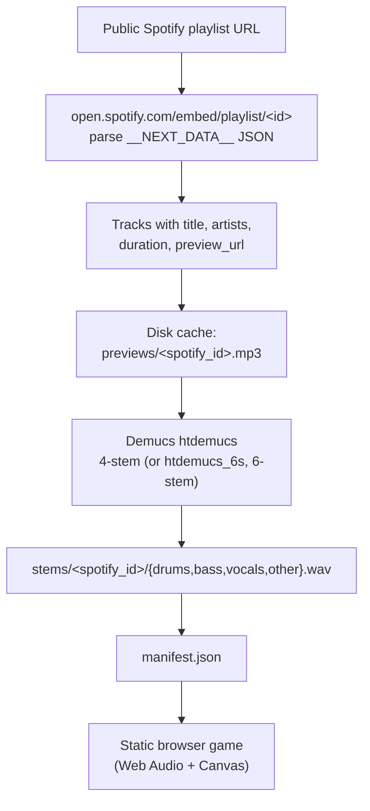

# StemGuessr

A music-guessing game built around source-separated stems. Given any *public* Spotify playlist URL, the ingest pipeline parses Spotify's own embed page for the playlist (no auth required), downloads each track's 30-second preview from Spotify's CDN, separates the clip into instrument stems with Demucs, and serves the stems to a static browser frontend that reveals one stem per round of guessing.

## Quickstart

No Python toolchain or Spotify credentials required — everything runs locally on your machine.

**Windows (no terminal):** download this repo as a ZIP ([Code → Download ZIP](https://github.com/kyleyhw/stemguessr/archive/refs/heads/main.zip)), unzip, and double-click **`run.bat`**. It installs [`uv`](https://docs.astral.sh/uv/) if missing, starts the server, and the game opens in your browser automatically.

**macOS / any terminal:** install `uv` (one line), then run the game:

```bash
curl -LsSf https://astral.sh/uv/install.sh | sh        # macOS/Linux; see run.bat for Windows
uvx stemguessr serve
```

Then paste a public Spotify playlist URL into the form and play. The first run downloads the dependencies (~2–3 GB, mostly PyTorch) and ~250 MB of Demucs weights; after that each track separates in ~5–15 s on CPU and becomes playable the moment it finishes. Re-running against the same playlist is a cache hit (no network, no Demucs). Distribution rationale and the PyPI release process are in [`docs/distribution.md`](docs/distribution.md).

**Development install:**

```bash
git clone https://github.com/kyleyhw/stemguessr.git
cd stemguessr
uv sync
uv run stemguessr serve --out ./cache
```

For non-interactive use, `stemguessr ingest <url> [--out PATH] [--stems {4,6}] [--limit N] [--force-refresh]` runs the same pipeline without the server — see [`docs/cli.md`](docs/cli.md).

## Status

**v0.1.3 — 2026-05-10.** `stemguessr serve` runs the whole thing in one command: open the page, paste a Spotify playlist URL, play. Progressive ingest streams tracks in as Demucs separates them; album cover on reveal; clickable + draggable waveform scrub; volume slider; no Spotify credentials required. See [`CHANGELOG.md`](CHANGELOG.md) for the release log and [`PROJECT_PLAN.md`](PROJECT_PLAN.md) for the phased build log.

## System architecture

The pipeline has three stages: two off-line and one in the browser.

1. **Spotify embed parsing** (off-line, no auth). Fetch `https://open.spotify.com/embed/playlist/<id>`, extract the `__NEXT_DATA__` JSON the Next.js page embeds for its React client. Each track in that JSON carries title, artist names, duration, and a direct 30-second MP3 preview URL on Spotify's CDN. The CDN URL is downloaded into the on-disk cache.
2. **Demucs source separation** (off-line, on-disk cache). Each cached preview is split into stems — by default `{drums, bass, vocals, other}` using `htdemucs`, optionally six stems via `htdemucs_6s` which adds `{guitar, piano}`. Outputs are WAV per stem under `stems/<spotify_id>/`.
3. **Static frontend** (browser). A single `index.html` fetches `manifest.json` and plays stems through Web Audio `AudioBufferSourceNode`s, summed through a master `GainNode` for volume control. The game reveals one stem per round; the player has four guesses (six in 6-stem mode).



## Source separation, briefly

Source separation is the inverse problem: given a mixture
$x(t) = \sum_{i=1}^{N} s_i(t)$, recover each source $s_i(t)$ for $i \in \{1, \dots, N\}$ where $N$ is the number of stems (4 or 6 here). The current state-of-the-art family — Hybrid Demucs (`htdemucs`) — is a U-Net with two parallel branches that exchange features at multiple depths:

- A **time-domain** 1-D convolutional branch that operates directly on the waveform $x(t)$.
- A **spectrogram-domain** 2-D branch that operates on the complex STFT $X(t, f) = \mathrm{STFT}\{x\}(t, f)$ and predicts complex-valued masks $M_i(t, f)$ for each source.

The two branch outputs are summed in the time domain to give the final source estimates $\hat{s}_i(t)$. The hybrid design is motivated by the empirical observation that some sources (drums, transients) are better separated in the time domain, while others (sustained tones, harmonic content) are better separated in the spectrogram domain.

A full derivation — training objective (L1 + multi-resolution STFT), complex-mask parameterisation, the HT transformer extension, and the choice of `htdemucs` over baseline Demucs — is in [`docs/separation.md`](docs/separation.md).

## Repository layout

```
stemguessr/
├── .github/
│   └── workflows/
│       └── publish.yml  ← PyPI trusted publishing on GitHub release
├── .gitignore
├── .pre-commit-config.yaml
├── .python-version
├── .secrets.baseline
├── CHANGELOG.md
├── LICENSE
├── PROJECT_PLAN.md
├── README.md            ← you are here
├── pyproject.toml
├── run.bat              ← Windows one-click launcher
├── uv.lock
├── docs/
│   ├── index.md         ← documentation hub
│   ├── spotify.md       ← Phase 2: Spotify ingest
│   ├── sources.md       ← Phase 3: preview sources
│   ├── separation.md    ← Phase 4: Demucs derivation
│   ├── manifest.md      ← Phase 5: manifest schema
│   ├── cli.md           ← Phase 6: CLI reference
│   ├── frontend.md      ← Phase 7: frontend architecture
│   └── distribution.md  ← Phase 9: packaging & install story
├── src/
│   └── stemguessr/
│       ├── __init__.py  ← package root (re-exports cli.main)
│       ├── spotify.py   ← Phase 2: Spotify Web API client
│       ├── sources.py   ← Phase 3: iTunes/Deezer preview lookup
│       ├── separate.py  ← Phase 4: Demucs separation wrapper
│       ├── manifest.py  ← Phase 5: manifest.json builder
│       ├── cli.py       ← Phase 6: stemguessr ingest <url> / serve
│       ├── server.py    ← HTTP server (frontend, cache, /api/*)
│       └── web/         ← Phase 7 frontend (ships inside the wheel)
│           ├── index.html
│           ├── styles.css
│           └── game.js
├── tests/
│   ├── __init__.py
│   ├── fixtures/
│   │   └── manifest.json
│   ├── test_spotify.py
│   ├── test_sources.py
│   ├── test_separate.py
│   ├── test_manifest.py
│   ├── test_cli.py
│   ├── test_server.py
│   ├── test_fixture_manifest.py
│   └── reports/
│       ├── phase2_spotify.md
│       ├── phase3_sources.md
│       ├── phase4_separate.md
│       ├── phase5_manifest.md
│       ├── phase6_cli.md
│       ├── phase7_frontend.md
│       ├── phase8_release.md
│       ├── ingest_shuffle.md
│       └── phase9_reset_score_distribution.md
└── cache/               ← default ingest output (gitignored)
```

## Documentation

- [`docs/index.md`](docs/index.md) — documentation hub.
- [`docs/spotify.md`](docs/spotify.md) — Spotify Web API integration, playlist parsing, ISRC extraction.
- [`docs/sources.md`](docs/sources.md) — preview lookup (iTunes / Deezer), caching, retry policy.
- [`docs/separation.md`](docs/separation.md) — Demucs algorithm derivation, hybrid waveform/spectrogram U-Net, training objective.
- [`docs/manifest.md`](docs/manifest.md) — `manifest.json` schema as the frontend contract.
- [`docs/cli.md`](docs/cli.md) — `stemguessr ingest <playlist_url>` reference.
- [`docs/frontend.md`](docs/frontend.md) — game UI architecture, state machine, waveform rendering.
- [`docs/distribution.md`](docs/distribution.md) — packaging, per-OS install story, PyPI trusted publishing.
- [`PROJECT_PLAN.md`](PROJECT_PLAN.md) — phased development plan with status tags.
- [`CHANGELOG.md`](CHANGELOG.md) — release notes.

## Development

The project uses **uv** for package and environment management, **ruff** for linting and formatting, **ty** for type-checking, and **detect-secrets** for pre-commit secret scanning. All four are wired through `pre-commit`.

```bash
# Install dev tooling and pre-commit hooks
uv sync --all-groups
uv run pre-commit install

# Run hooks against all files
uv run pre-commit run --all-files

# Run the test suite (72 tests, fully offline)
uv run pytest
```

