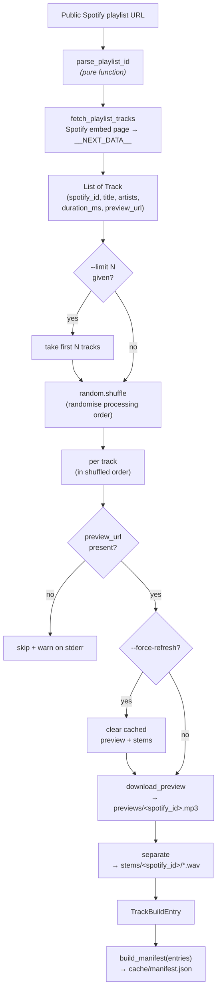

# StemGuessr CLI Reference

This document describes the command-line interface implemented in [`src/stemguessr/cli.py`](../src/stemguessr/cli.py): the orchestration layer that composes Phases 2–5 into a single user-facing command.

## Synopsis

```
stemguessr serve [--out PATH] [--host HOST] [--port N]
stemguessr ingest <playlist_url> [--out PATH] [--stems {4,6}] [--force-refresh] [--limit N]
stemguessr --version
```

For interactive use, `stemguessr serve` is the recommended entry point — it hosts the frontend, serves the cache, and exposes `POST /api/ingest` so a playlist URL pasted into the in-page form drives the whole pipeline. `ingest` remains for batch / scripted use.

`stemguessr` is registered as a console script in `pyproject.toml`. After `uv sync` (or `pip install`), it is on the `PATH`.

**No authentication is required.** Public playlist data and 30-second preview URLs come from Spotify's public embed page; see [`spotify.md`](spotify.md) for details.

## What `ingest` does



The whole pipeline is a single linear function; per-track failures (Spotify did not provide a preview URL) are reported on stderr and skipped without aborting the run.

**Why the shuffle happens here, not (only) in the frontend.** The manifest is written progressively — one rewrite per separated track — and the frontend appends newly arrived tracks in arrival order (its own Fisher–Yates shuffle covers only the tracks present at its *first* manifest fetch, which during a live ingest is typically a single track). Ingestion order is therefore the effective play order, and without a server-side shuffle the first playable track would always be the playlist's first track. `random.shuffle` runs *after* the `--limit` slice so that flag keeps its documented "first N tracks of the playlist" semantics (deterministic track selection, and hence cache-friendly smoke tests) while the processing order of the selection remains random.

## Arguments

| Name | Type | Required | Default | Description |
|------|------|----------|---------|-------------|
| `playlist_url` | string | yes | — | Any of the URL/URI/bare-ID forms parsed by [`parse_playlist_id`](spotify.md#public-api). |
| `--out` / `-o` | path | no | `./cache` | Cache root — receives `previews/`, `stems/`, `manifest.json`. Created if missing. |
| `--stems` | int | no | `4` | `4` (htdemucs) or `6` (htdemucs_6s). Any other value → exit code 1. |
| `--force-refresh` | bool | no | `false` | Delete cached preview and stem files for **every** track in the playlist before re-processing. |
| `--limit` / `-n` | int | no | _none_ | Process only the first N tracks of the playlist (selection happens before the order shuffle). Useful for quick smoke tests against large playlists. |

## Environment variables

None required. Earlier versions used the Spotify Web API's Client Credentials flow with `SPOTIFY_CLIENT_ID` / `SPOTIFY_CLIENT_SECRET`; the embed-based path in v0.1.1 onwards needs no credentials at all.

## `stemguessr serve`

Hosts the frontend and the cache, and exposes a `POST /api/ingest` endpoint so an `ingest` run can be started from the browser without dropping back to the terminal.

| Flag | Default | Description |
|------|---------|-------------|
| `--out` / `-o` | `./cache` | Cache root the server reads from and writes into. |
| `--host` | `127.0.0.1` | Bind address. The localhost default keeps the server private to the machine. |
| `--port` / `-p` | `8765` | TCP port. |
| `--no-browser` | off | Do not open the game in the default browser on startup. The default auto-open is what makes the `run.bat` / `uvx` distribution zero-instruction (see [`distribution.md`](distribution.md)); the flag exists for headless and development use. |

Routes:

| Method | Path | Behaviour |
|--------|------|-----------|
| GET | `/`, `/index.html`, `/styles.css`, `/game.js` | Static frontend, served from the package's bundled `web/` directory. |
| GET | `/manifest.json`, `/stems/*`, `/previews/*` | Cache contents, served from `--out`. |
| POST | `/api/ingest` | JSON body: `{"playlist_url": "...", "n_stems": 4, "limit": null}`. Starts an ingest run in a daemon thread and returns 202. Concurrent calls while a run is in flight return 409 Conflict. |
| POST | `/api/reset` | Cancels any ingest in flight, waits for it to stop, then deletes `manifest.json`, `stems/`, and `previews/` from `--out`; returns 200. Idempotent: resetting an empty cache is 200. Returns 503 only if a cancelled ingest fails to stop within the join budget (60 s) — a retry once the current track finishes succeeds. See *Cancellation* below. |

The server is single-flight: only one ingest runs at a time. Closing the server with Ctrl-C terminates the daemon thread; the `try / finally` in `run_ingest_pipeline` still writes a `complete: true` manifest with whatever entries had been separated.

### Cancellation

`run_ingest_pipeline` polls a `should_cancel` predicate once **before each track** and, if it returns true, breaks the loop (still finalising the manifest via its `finally`). Cancellation is therefore *cooperative and between-track*: a Demucs separation already under way is not interrupted — PyTorch offers no safe mid-inference cancellation point — so the effective latency of a cancel is at most the time to finish the current track (a single separation, ~5–15 s on CPU for 4 stems, more for 6).

`POST /api/reset` uses this: it sets the run's cancel flag and **joins the ingest thread before deleting anything**. That ordering is what makes reset-during-ingest safe — the thread has run its final manifest write and terminated before the delete begins, so it cannot re-create files under the delete. The join is bounded by a 60 s budget (`_CANCEL_JOIN_TIMEOUT`); overshooting it yields 503 with the cache left intact rather than a delete racing a live writer. The CLI's `ingest` command does not pass `should_cancel` (its default never cancels), so terminal ingest behaviour is unchanged.

## Output layout

After a successful run with `--out ./cache`:

```
cache/
├── manifest.json            ← frontend reads this
├── previews/
│   └── {ISRC}.{m4a|mp3}     ← Phase 3 cache; not referenced by manifest
└── stems/
    └── {ISRC}/
        ├── drums.wav
        ├── bass.wav
        ├── vocals.wav
        └── other.wav        ← (+ guitar.wav, piano.wav for --stems 6)
```

The frontend (Phase 7) is configured to serve `cache/` as its static root, so the relative URLs in the manifest resolve directly as static-asset paths.

## Exit codes

| Code | Cause |
|------|-------|
| `0` | Successful ingest. Manifest written. |
| `1` | Bad input: invalid `--stems`, unparseable playlist URL, or playlist embed page unreachable / private. |
| `≥ 2` | Unexpected exception (network failure that survived retries, Demucs crash, disk full). The traceback is propagated unmodified. |

A run with one or more skipped tracks (no ISRC, no preview source) still exits `0`. The skip is a normal data outcome, not an error.

## Idempotency and `--force-refresh`

By design, the pipeline is idempotent. On a second run over the same playlist:

- **Previews** are cache-hit at Phase 3 (existing file → no network call).
- **Stems** are cache-hit at Phase 4 (all expected stem files exist → no Demucs call).
- The manifest is rewritten unconditionally, with the current build timestamp.

Re-running is therefore essentially free, and is the recommended way to rebuild the manifest after adding tracks to the source playlist.

`--force-refresh` overrides this by clearing the cache entries for every track in the *current* playlist before processing. Tracks that are no longer in the playlist are not touched (their orphaned cache entries persist; users can `rm -rf cache/{stems,previews}` for a hard reset).

## Examples

```bash
# Default: 4 stems, cache in ./cache.
stemguessr ingest "https://open.spotify.com/playlist/37i9dQZF1DXcBWIGoYBM5M"

# Quick smoke test — first 3 tracks only.
stemguessr ingest "https://open.spotify.com/playlist/..." --limit 3

# 6-stem mode (separates guitar/piano from "other").
stemguessr ingest \
    "spotify:playlist:37i9dQZF1DXcBWIGoYBM5M" \
    --stems 6 \
    --out ./my_cache

# Re-ingest after model upgrade.
stemguessr ingest "..." --force-refresh
```

## Testing

Tests in [`tests/test_cli.py`](../tests/test_cli.py) use `typer.testing.CliRunner` to invoke the app in-process. Every pipeline stage is monkeypatched at the `stemguessr.cli` import boundary, so the tests exercise orchestration logic alone (argument validation, exit codes, skip-on-miss, force-refresh side effects).

Coverage:

- Bad `--stems` value → exit code 1, error on stderr.
- Bad playlist URL → exit code 1, error on stderr.
- Happy path → manifest with both tracks, model field set correctly.
- `--stems 6` → separate called with `htdemucs_6s` per track.
- Track with `isrc=None` → reported and skipped, manifest contains only the survivor.
- Track with no preview from any source → reported and skipped.
- `--force-refresh` → stale cached preview and stem files are overwritten.
- Processing order follows `random.shuffle` (asserted deterministically by stubbing the shuffle with an in-place reversal), and the fetched track list itself is never mutated by the shuffle.

Run the tests:

```bash
uv run pytest tests/test_cli.py -v
```

Test reports: [`../tests/reports/phase6_cli.md`](../tests/reports/phase6_cli.md) (original orchestration suite) and [`../tests/reports/ingest_shuffle.md`](../tests/reports/ingest_shuffle.md) (shuffled ingest order).
