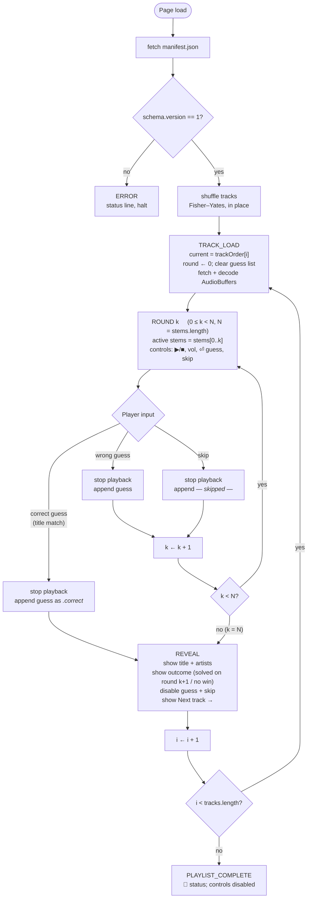
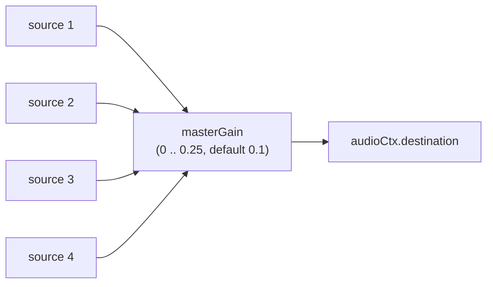

    # Frontend Architecture

This document describes the static browser frontend in [`web/`](../web/): a single HTML file, a single CSS file, and a single ES module of vanilla JavaScript. There is no framework, no bundler, and no build step.

## Why no framework

The frontend has one screen, three sections (player, guess form, reveal), and a simple state machine of fewer than ten states. A framework would add tooling complexity, vendor lock-in, and a build step for no commensurate benefit. Vanilla DOM + ES modules keeps the entire frontend reviewable in three files totalling ~600 lines.

## File layout

```
web/
├── index.html         ← semantic markup, three top-level <section>s
├── styles.css         ← cream / oxblood / ink palette; Fraunces + JetBrains Mono
├── game.js            ← module: state, lifecycle, playback, guessing, render
└── fixtures/
    └── manifest.json  ← schema-correct fake manifest for development / review
```

To run the game, copy these four files into the cache directory produced by `stemguessr ingest` (so they live alongside `manifest.json` and `stems/`), then serve the directory:

```bash
stemguessr ingest "https://open.spotify.com/playlist/..." --out ./cache
cp web/index.html web/styles.css web/game.js ./cache/
cd ./cache
python -m http.server 8000
# open http://localhost:8000/
```

## Game flow

The full state machine, including the per-round branches the player drives:



Runtime state lives in the single `state` object at the top of `game.js`; the rest of the file is functions that read and mutate it. There is no two-way data binding and no re-render loop — the DOM is updated imperatively at the few transition points that need it.

## Audio pipeline

The frontend uses the **Web Audio API**. On track load, every stem WAV is fetched and decoded into an [`AudioBuffer`](https://developer.mozilla.org/en-US/docs/Web/API/AudioBuffer); buffers are cached by URL across the session so `--force-refresh`-induced re-fetches are the only repeat downloads.

Per round, `play()` creates one [`AudioBufferSourceNode`](https://developer.mozilla.org/en-US/docs/Web/API/AudioBufferSourceNode) per active stem, all started at the same `audioCtx.currentTime`. Because Demucs preserves the input clip's timing exactly, the stems are sample-aligned: starting them simultaneously reconstitutes the mixture.

A single master [`GainNode`](https://developer.mozilla.org/en-US/docs/Web/API/GainNode) sits between every source and `audioCtx.destination`, driven by the volume slider:



The reason for the deliberately low default and capped maximum: stems are summed (not averaged) at the destination, and the unmixed sum of four sources can exceed unity gain by a wide margin, especially after Demucs's reconstruction. Capping at 0.25 keeps even the noisiest mix below clipping and the default at 0.1 protects unsuspecting listeners with headphones.

When the user clicks pause (or the clip ends), every active source is `stop()`-ped and discarded. AudioBufferSourceNodes are single-use by design — `play()` re-creates them.

### Why not a single mixed buffer

We could bake the active mix into a fresh AudioBuffer per round and play that single buffer. We don't, because:

1. **Switching rounds is instant** with the source-node approach: the buffers are already decoded; play() just starts new sources.
2. **Per-stem volume control** (a likely future enhancement) is trivial when each stem has its own GainNode and impossible after summing.

## Waveform visualisation

The canvas at the top of the player draws the *first active stem's* waveform — a classic per-pixel min/max amplitude plot of channel 0, rendered to a 800 × 160 px canvas. During playback, a vertical cursor line is overlaid at the playhead position, advanced via `requestAnimationFrame`.

This is intentionally simple:

- We do **not** mix all active stems' waveforms. The first stem suffices as a visual anchor; the audio output already mixes everything.
- We do **not** use [`AnalyserNode`](https://developer.mozilla.org/en-US/docs/Web/API/AnalyserNode) for a live spectrogram. The clip is 30 s of pre-known audio; rendering once from the AudioBuffer is more efficient and visually steadier than analyser-driven redraws.

Algorithmically, for a buffer of $N$ samples drawn into a canvas of width $W$:

$$
s = \left\lceil \frac{N}{W} \right\rceil, \quad
y_{\min}(x) = \min_{i \in [xs,\, (x{+}1)s)} d[i], \quad
y_{\max}(x) = \max_{i \in [xs,\, (x{+}1)s)} d[i]
$$

and at column $x$ we draw a vertical line from $(x, h/2 - y_{\max}\,h/2)$ to $(x, h/2 - y_{\min}\,h/2)$. Linear time in $N$, single pass.

## Answer matching

The guess input is fuzzy-matched against the track title using a small normaliser:

```
lowercase
→ NFD-normalise (decomposes diacritics)
→ strip diacritic combining marks (U+0300..U+036F)
→ drop parenthetical/bracketed text  ("(Remix)", "[feat. X]")
→ strip non-word, non-whitespace characters
→ collapse whitespace and trim
```

Equality of the normalised forms means correct. This handles the most common Bandle frustrations (case, accents, "(Remix)" suffixes, punctuation) without going as far as Levenshtein, which would let typos through. A future enhancement could allow opt-in fuzzy matching with an explicit threshold.

Artist match is intentionally not required. Many guessing games conflate *naming the song* with *naming the song and its artist*, which makes guessing artificially harder when the player is right but typed only the title.

## Aesthetic

Late-night radio studio: cream paper with oxblood accents, Fraunces (a high-contrast italic serif) for display type, JetBrains Mono for body and controls.

| Use | Token | Hex |
|-----|-------|-----|
| Background | `--cream` | `#f3e9d2` |
| Player block | `--cream-deep` | `#e8dcbe` |
| Borders, separators | `--cream-shadow` | `#d8c8a3` |
| Body type | `--ink` | `#1f140b` |
| Secondary type | `--ink-soft` | `#5c4633` |
| Tertiary type | `--ink-faint` | `#8b7355` |
| Accent (buttons, cursor) | `--oxblood` | `#6a1d24` |
| Hover accent | `--oxblood-bright` | `#9a2a35` |

## Manifest contract assumed

The frontend requires:

- `manifest.json` available at the same origin / path as `index.html`.
- Schema `version: 1`. Other versions are rejected at load time.
- Each track's `stems` map contains an entry for every name in the top-level `stems` array.
- Stem URLs resolve to fetchable audio decoded by `AudioContext.decodeAudioData` — i.e., WAV / M4A / MP3 / OGG / FLAC depending on browser support.

When the manifest fetch fails or the schema is wrong, the status line shows a descriptive error and the game halts. There is no partial / degraded mode.

## Fixtures

[`web/fixtures/manifest.json`](../web/fixtures/manifest.json) is a schema-correct fake manifest with two tracks pointing at non-existent stem URLs. It is **not** runnable (the audio fetches will 404), but it is useful for code review of the manifest reader and for offline frontend development with a debugger that intercepts `fetch`.

A future enhancement is a `stemguessr serve` command that copies `web/*` next to `manifest.json` and starts an HTTP server, removing the manual `cp` step.

## Testing

The frontend has no automated tests in the current phase; it is exercised manually against ingested playlists. End-to-end coverage is **Phase 8** (Integration & Polish): a Playwright run against a live ingest fixture, gating on render correctness and game-loop progression.

## References

<span id="ref-webaudio">[1]</span> W3C. *Web Audio API*. [Link](https://www.w3.org/TR/webaudio/)

<span id="ref-fonts-fraunces">[2]</span> Undercase Type. *Fraunces*. [Link](https://fonts.google.com/specimen/Fraunces)

<span id="ref-fonts-jbmono">[3]</span> JetBrains. *JetBrains Mono*. [Link](https://www.jetbrains.com/lp/mono/)
