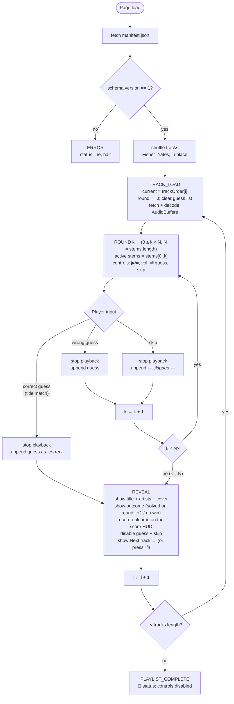
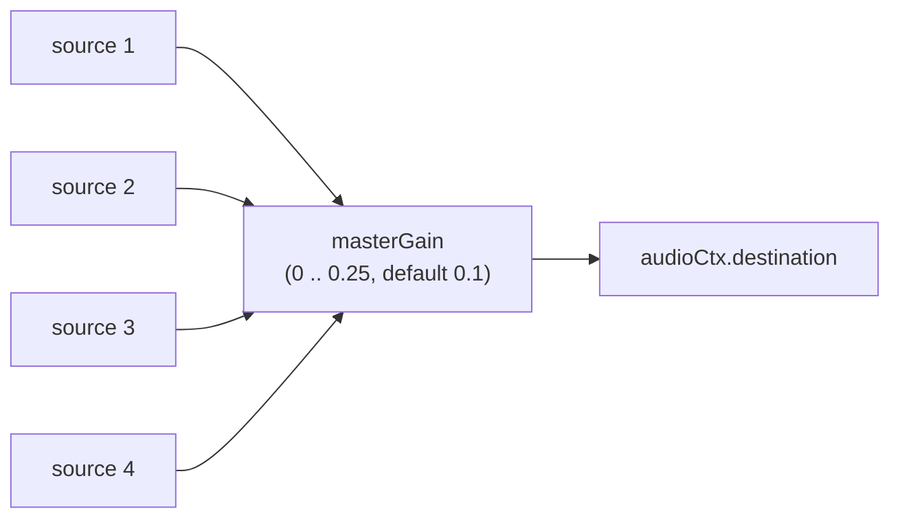

# Frontend Architecture

This document describes the static browser frontend in [`src/stemguessr/web/`](../src/stemguessr/web/): a single HTML file, a single CSS file, and a single ES module of vanilla JavaScript. There is no framework, no bundler, and no build step. The directory lives inside the package so the built wheel is self-contained — see [`distribution.md`](distribution.md).

## Why no framework

The frontend has one screen, three sections (player, guess form, reveal), and a simple state machine of fewer than ten states. A framework would add tooling complexity, vendor lock-in, and a build step for no commensurate benefit. Vanilla DOM + ES modules keeps the entire frontend reviewable in three files totalling ~600 lines.

## File layout

```
src/stemguessr/web/
├── index.html         ← semantic markup, three top-level <section>s + HUD
├── styles.css         ← cream / oxblood / ink palette; Fraunces + JetBrains Mono
└── game.js            ← module: state, lifecycle, playback, guessing, render
```

To run the game, `stemguessr serve` hosts these files together with the cache contents (`manifest.json`, `stems/`, `previews/`) under one origin and opens the browser:

```bash
stemguessr serve --out ./cache
```

## Game flow

The full state machine, including the per-round branches the player drives:



Runtime state lives in the single `state` object at the top of `game.js`; the rest of the file is functions that read and mutate it. There is no two-way data binding and no re-render loop — the DOM is updated imperatively at the few transition points that need it.

### Keyboard: Enter is always the primary action

Enter triggers whichever "red" (primary) button the current state shows. The guess and ingest forms get this natively from HTML form submission; the reveal state — where no form has focus — gets it from a document-level `keydown` handler that fires `nextTrack()` whenever the reveal card is visible. The handler calls `preventDefault()`, which also suppresses the browser's Enter→click synthesis when the *Next track* button itself is focused, so the advance fires exactly once.

### Score HUD (hover to expand)

A fixed top-right chip cluster keeps the main UI unchanged while exposing two controls:

- **`score n/m`** — `n` tracks solved out of `m` completed. Hovering (or keyboard-focusing, via `:focus-within`) expands a panel that groups song titles by the stage each was solved on (stage $k$ = solved with $k$ stems audible), plus a *missed* group. Outcomes are recorded at reveal time — the single point where a track's result becomes final — so tracks abandoned with *Next track* before any reveal are not scored. The scoreboard is session-scoped by design (a reload starts fresh); it is zeroed on reset and when a new ingest begins.
- **`↺ reset`** — described below.

### Reset

The reset chip returns the game to the paste-a-playlist form after a native `confirm()` "Are you sure?" gate (modal, keyboard-accessible, zero markup — the minimal implementation of a destructive-action guard). On confirmation the client calls `POST /api/reset` — the server deletes `manifest.json`, `stems/`, and `previews/` from the cache, refusing with HTTP 409 while an ingest is in flight — then tears down all manifest-derived client state (audio, poll timer, decoded buffers, scoreboard) and shows the ingest prompt. A cancelled dialog is a strict no-op.

### Progressive ingest

When the CLI is still ingesting (`manifest.complete === false`), the frontend polls `manifest.json` every **2 seconds** until `complete` flips to `true`. New tracks (identified by `id`) are appended to `state.trackOrder` *in arrival order*, without reshuffling the tracks already there — the player's shuffle is preserved. Arrival order is itself random: the backend shuffles its processing order before ingesting (see [`cli.md`](cli.md)), because during a live ingest the frontend's own Fisher–Yates shuffle only ever covers the tracks present at the first fetch — typically a single track — and ingestion order would otherwise become the effective play order.

Two transition cases that the polling handles explicitly:

1. **Empty start.** Initial fetch sees `tracks: []` with `complete: false`. Status reads "Waiting for first track to be separated…", controls are disabled. As soon as the first track lands and the next poll picks it up, the frontend triggers `loadCurrentTrack()` automatically.
2. **Ran out, then rescued.** Player has finished every track that was available and the UI shows "🎉 Playlist complete." (or its waiting equivalent). A subsequent poll appends a new track. Because `state.currentIndex` was at the end and is now back inside the array, the frontend re-triggers `loadCurrentTrack()` and the game continues seamlessly.

While polling, the status line reads `Track i/N · ingesting M/Y`, where `M` is the count of fully-separated tracks and `Y` is `expected_tracks` from the manifest.

## Audio pipeline

The frontend uses the **Web Audio API**. On track load, every stem WAV is fetched and decoded into an [`AudioBuffer`](https://developer.mozilla.org/en-US/docs/Web/API/AudioBuffer); buffers are cached by URL across the session so `--force-refresh`-induced re-fetches are the only repeat downloads.

Per round, `play()` creates one [`AudioBufferSourceNode`](https://developer.mozilla.org/en-US/docs/Web/API/AudioBufferSourceNode) per active stem, all started at the same `audioCtx.currentTime`. Because Demucs preserves the input clip's timing exactly, the stems are sample-aligned: starting them simultaneously reconstitutes the mixture.

A single master [`GainNode`](https://developer.mozilla.org/en-US/docs/Web/API/GainNode) sits between every source and `audioCtx.destination`, driven by the volume slider:



The reason for the deliberately low default and capped maximum: stems are summed (not averaged) at the destination, and the unmixed sum of four sources can exceed unity gain by a wide margin, especially after Demucs's reconstruction. Capping at 0.25 keeps even the noisiest mix below clipping and the default at 0.1 protects unsuspecting listeners with headphones.

When the user clicks pause (or the clip ends), every active source is `stop()`-ped and discarded. AudioBufferSourceNodes are single-use by design — `play()` re-creates them.

### Why not a single mixed buffer

We could bake the active mix into a fresh AudioBuffer per round and play that single buffer. We don't, because:

1. **Switching rounds is instant** with the source-node approach: the buffers are already decoded; play() just starts new sources.
2. **Per-stem volume control** (a likely future enhancement) is trivial when each stem has its own GainNode and impossible after summing.

## Waveform visualisation

The canvas at the top of the player draws the waveform of the *summed active-stem mix* (channel 0 of every currently audible stem, added sample-wise and peak-normalised) — a classic per-pixel min/max amplitude plot, rendered to an 800 × 200 px canvas. The plot therefore grows as rounds reveal more stems, matching what the ear hears. During playback, a vertical cursor line is overlaid at the playhead position, advanced via `requestAnimationFrame`; the summed min/max envelope is cached per round so per-frame redraws do not re-scan millions of samples.

This is intentionally simple: we do **not** use [`AnalyserNode`](https://developer.mozilla.org/en-US/docs/Web/API/AnalyserNode) for a live spectrogram. The clip is 30 s of pre-known audio; rendering once from the AudioBuffers is more efficient and visually steadier than analyser-driven redraws.

Algorithmically, for a summed signal of $N$ samples drawn into a canvas of width $W$:

$$
s = \left\lceil \frac{N}{W} \right\rceil, \quad
y_{\min}(x) = \min_{i \in [xs,\, (x{+}1)s)} d[i], \quad
y_{\max}(x) = \max_{i \in [xs,\, (x{+}1)s)} d[i]
$$

and at column $x$ we draw a vertical line from $(x, h/2 - y_{\max}\,h/2)$ to $(x, h/2 - y_{\min}\,h/2)$. Linear time in $N$, single pass.

## Answer matching

The guess input is fuzzy-matched against the track title using a small normaliser:

```
lowercase
→ NFD-normalise (decomposes diacritics)
→ strip diacritic combining marks (U+0300..U+036F)
→ drop parenthetical/bracketed text  ("(Remix)", "[feat. X]")
→ strip non-word, non-whitespace characters
→ collapse whitespace and trim
```

Equality of the normalised forms means correct. This handles the most common case-insensitive / accent / parenthetical / punctuation differences without going as far as Levenshtein, which would let typos through. A future enhancement could allow opt-in fuzzy matching with an explicit threshold.

Artist match is intentionally not required. Many guessing games conflate *naming the song* with *naming the song and its artist*, which makes guessing artificially harder when the player is right but typed only the title.

## Aesthetic

Late-night radio studio: cream paper with oxblood accents, Fraunces (a high-contrast italic serif) for display type, JetBrains Mono for body and controls.

| Use | Token | Hex |
|-----|-------|-----|
| Background | `--cream` | `#f3e9d2` |
| Player block | `--cream-deep` | `#e8dcbe` |
| Borders, separators | `--cream-shadow` | `#d8c8a3` |
| Body type | `--ink` | `#1f140b` |
| Secondary type | `--ink-soft` | `#5c4633` |
| Tertiary type | `--ink-faint` | `#8b7355` |
| Accent (buttons, cursor) | `--oxblood` | `#6a1d24` |
| Hover accent | `--oxblood-bright` | `#9a2a35` |

## Manifest contract assumed

The frontend requires:

- `manifest.json` available at the same origin / path as `index.html`.
- Schema `version: 1`. Other versions are rejected at load time.
- Each track's `stems` map contains an entry for every name in the top-level `stems` array.
- Stem URLs resolve to fetchable audio decoded by `AudioContext.decodeAudioData` — i.e., WAV / M4A / MP3 / OGG / FLAC depending on browser support.

When the manifest fetch fails or the schema is wrong, the status line shows a descriptive error and the game halts. There is no partial / degraded mode.

## Fixtures

[`tests/fixtures/manifest.json`](../tests/fixtures/manifest.json) is a schema-correct fake manifest with two tracks pointing at non-existent stem URLs. It is **not** runnable (the audio fetches will 404), but it is useful for code review of the manifest reader and for offline frontend development with a debugger that intercepts `fetch`. It lives under `tests/` (not inside the package) so it does not ship in the wheel; `tests/test_fixture_manifest.py` guards it against schema drift.

## Testing

The frontend has no automated unit tests; it is exercised end-to-end with Playwright against a cached playlist, covering the guess loop, reveal, score HUD, reset (both confirm and cancel paths), and Enter-key behaviour. The latest run is documented in [`../tests/reports/phase9_reset_score_distribution.md`](../tests/reports/phase9_reset_score_distribution.md).

## References

<span id="ref-webaudio">[1]</span> W3C. *Web Audio API*. [Link](https://www.w3.org/TR/webaudio/)

<span id="ref-fonts-fraunces">[2]</span> Undercase Type. *Fraunces*. [Link](https://fonts.google.com/specimen/Fraunces)

<span id="ref-fonts-jbmono">[3]</span> JetBrains. *JetBrains Mono*. [Link](https://www.jetbrains.com/lp/mono/)
